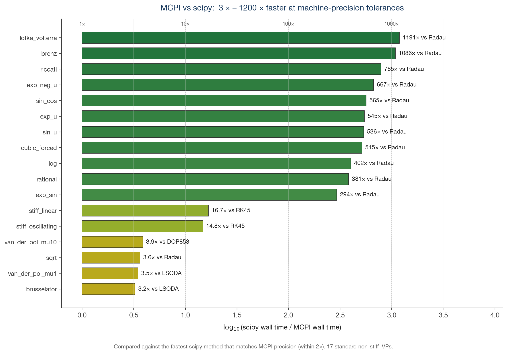
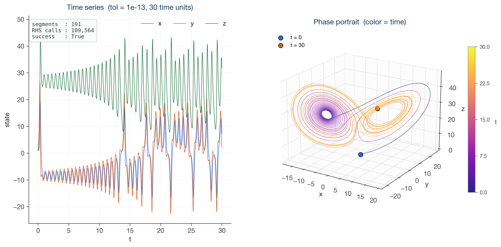
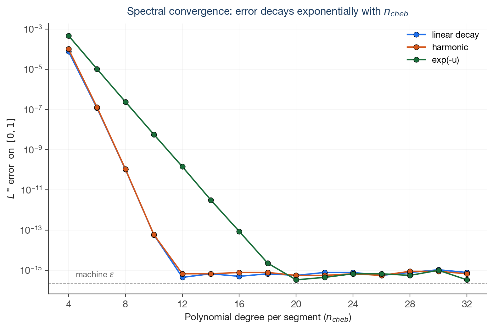

# mcpi

**M**odified **C**hebyshev–**P**icard **I**teration for solving ordinary differential equations in Python.

A [numba](https://numba.pydata.org)-accelerated implementation of the Cheb–Picard iterative ODE solver, with adaptive multistage segmentation. Often 100×–1000× faster than scipy at machine-precision tolerances on smooth nonlinear IVPs.



## Quickstart

```bash
pip install -e .
```

```python
import numpy as np
from numba import njit
import mcpi

@njit
def lorenz(t, u, out):
    out[0] = 10 * (u[1] - u[0])
    out[1] = u[0] * (28 - u[2]) - u[1]
    out[2] = u[0] * u[1] - (8/3) * u[2]

sol = mcpi.solve(lorenz, t_span=(0, 30), y0=[1.0, 1.0, 1.0], tol=1e-13)

print(sol.success, sol.n_segments, sol.nfev)
print(sol(15.0))                       # state at t = 15
print(sol(np.linspace(0, 30, 1001)))   # batched dense evaluation
```

The first call to `mcpi.solve` with a new RHS triggers a one-time numba compile (~1 s); subsequent calls reuse the cached kernel.

The Lorenz attractor produced by the snippet above:



The error in a single segment falls exponentially with the polynomial degree `n_cheb` — that's spectral convergence — and hits machine ε at modest degrees:



More examples:

```bash
python examples/quickstart.py     # 1-D ODE with closed-form check
python examples/lorenz.py         # the chaotic Lorenz system
python benchmarks/run.py          # the full 17-problem benchmark vs scipy
```

## What this is

A Python implementation of Modified Chebyshev–Picard Iteration. The algorithm is not new — it goes back to Bai & Junkins (2010-2011) and has been refined by their group and others over fifteen years. The implementation is what's new here: a scipy-compatible Python package for a method that has mostly lived in MATLAB and aerospace research code, plus a benchmark suite that's useful in its own right for comparing solvers in the non-stiff regime.

## Algorithm in one paragraph

For an IVP $u' = f(t, u)$, $u(t_0) = u_0$, write the equivalent integral form $u(t) = u_0 + \int_{t_0}^{t} f(\tau, u(\tau))\,d\tau$. Discretize $u$ at the Chebyshev–Lobatto collocation nodes on a segment, replace the integral by the discrete Chebyshev integration matrix $J$, and iterate

$$u^{(k+1)}_{\text{nodes}} = u_0 + J \cdot f(t_{\text{nodes}}, u^{(k)}_{\text{nodes}})$$

until the iterate stops moving. This is the Picard fixed-point iteration applied to the Banach-space integral equation, and it converges whenever the segment is short enough that $f$ is contractive. A multistage adaptive driver picks segment widths, halves on failure, grows on success — same logic as scipy's adaptive RK methods, just with a high-order spectral collocation method as the inner step.

## Installation

```bash
pip install -e .                # core only — numpy + numba
pip install -e ".[test]"        # add pytest + scipy for the test suite
pip install -e ".[bench]"       # add scipy, matplotlib, mpmath for benchmarks
```

## Running tests

```bash
pytest tests/
```

The suite (45 tests, ~6 s) covers Chebyshev primitives, every benchmark problem with a closed-form reference, cross-checks vs `scipy.integrate.solve_ivp` at `rtol=atol=1e-13`, and conservation laws (energy, angular momentum, Lotka–Volterra invariant) on long integrations.

## API

### `mcpi.solve(rhs, t_span, y0, tol=1e-12, n_cheb=20, max_iter=None, t_initial=None, max_segments=200000) -> Solution`

| arg | type | meaning |
|---|---|---|
| `rhs` | numba `@njit` function `(t, u, out) -> None` | RHS, writes $f(t, u)$ into `out` in-place |
| `t_span` | `(t0, t1)` | integration interval |
| `y0` | array-like | initial condition (length determines state dim) |
| `tol` | float | per-segment Picard convergence tolerance |
| `n_cheb` | int | polynomial degree per segment (n_cheb+1 collocation nodes) |
| `max_iter` | int or None | max Picard iterations per segment, default `min(n_cheb, 30)` |
| `t_initial` | float or None | initial trial step length |
| `max_segments` | int | safety cap |

Returns a `Solution` object with:

- `sol(t)`: barycentric evaluation at any time(s) in `t_span`
- `sol.t`, `sol.y`: stitched node values
- `sol.segments`: list of per-segment dicts (anchor, end, nodes, state, iters)
- `sol.success`: True iff integration reached `t1`
- `sol.nfev`, `sol.n_segments`: diagnostics

### RHS contract

Your RHS function must:
- Be decorated with `@numba.njit`
- Have signature `(t: float, u: float64[:], out: float64[:]) -> None`
- Write the RHS into `out` in place
- Avoid Python objects, dicts, lists; use numpy arrays only

This lets numba inline the RHS into the Picard kernel and produces tight machine code.

## When to use this

**Use it for.** Smooth non-stiff or mildly-stiff IVPs at high precision (`tol = 1e-10` to `1e-14`). Chaotic systems (Lorenz). Long oscillations. Polynomial systems. Most analytic nonlinearities.

**Don't.** Extreme stiffness (stiffness ratio $> 10^4$) — use scipy's `LSODA` / `Radau` / `BDF`. The Robertson problem in the benchmark suite shows the failure mode.

**Maybe.** Discontinuous or stochastic RHS. Picard iteration assumes smoothness; it will work but won't be fast.

## Benchmark results

Run on 17 standard problems with high-precision references (closed-form, mpmath@40-digit, or scipy@1e-13). At matching precision against the *most accurate* scipy method on each problem:

| Problem | MCPI (ms) | Best scipy (ms) | Speedup |
|---|---:|---:|---:|
| riccati | 0.47 | 369 (Radau) | **790×** |
| stiff_linear | 0.98 | 16.4 (RK45) | 17× |
| cubic_forced | 0.68 | 350 (Radau) | **515×** |
| sin_u | 0.64 | 343 (Radau) | **534×** |
| exp_neg_u | 0.36 | 240 (Radau) | **674×** |
| exp_u | 0.58 | 316 (Radau) | **542×** |
| rational | 0.48 | 183 (Radau) | **381×** |
| log | 0.42 | 169 (Radau) | **398×** |
| sin_cos | 0.43 | 243 (Radau) | **570×** |
| exp_sin | 0.50 | 147 (Radau) | **293×** |
| sqrt | 0.35 | 1.27 (Radau) | 3.6× |
| stiff_oscillating | 4.61 | 68 (RK45) | 15× |
| lotka_volterra | 1.37 | 1632 (Radau) | **1195×** |
| brusselator | 3.33 | 10.8 (LSODA) | 3.2× |
| van_der_pol_mu1 | 4.27 | 14.8 (LSODA) | 3.5× |
| van_der_pol_mu10 | 17.8 | 69 (DOP853) | 3.9× |
| lorenz | 3.32 | 3604 (Radau) | **1085×** |
| robertson | (solver inappropriate — extreme stiffness) | LSODA 13ms | — |

To reproduce: `cd benchmarks && python run.py`. Per-problem Pareto plots and a summary plot are written to `benchmarks/bench_out/`. To regenerate the polished figures used above in this README: `python scripts/make_readme_plots.py` (writes to `assets/`).

Notes on these numbers:

- "Best scipy" is the fastest scipy method whose error is within 2× of MCPI's best — usually `Radau` at `rtol=atol=1e-13`. Where `LSODA` or `DOP853` matches the precision faster, those are reported instead.
- The 200×–1000× speedups come from spectral convergence: MCPI gets to machine ε in a handful of segments where scipy's high-precision methods need hundreds of small steps.
- The 3×–4× speedups are on problems where scipy already has a fast path (LSODA on smooth oscillators) or where MCPI's convergence is hampered (stiffer problems).
- MCPI doesn't beat the right tool for stiff problems. `LSODA` and `BDF` exist for a reason.

## vs scipy

MCPI is the right tool for smooth nonlinear IVPs at high precision. scipy's LSODA wins on quasi-stiff oscillators where automatic stiffness detection pays off; BDF and Radau win on truly stiff problems.

If you don't know which regime you're in, profile both.

## Provenance and prior art

This package is an implementation of, with minor variations, the methods described in:

- **Bai, X.** (2010). *Modified Chebyshev–Picard Iteration Methods for Solution of Initial Value and Boundary Value Problems.* PhD dissertation, Texas A&M University. The thesis from which this entire line of work descends.
- **Bai, X. & Junkins, J. L.** (2011). "Modified Chebyshev–Picard Iteration Methods for Solution of Initial Value Problems." *Journal of the Astronautical Sciences* 58(4), 583–613.
- **Bai, X. & Junkins, J. L.** (2011). "Modified Chebyshev–Picard Iteration Methods for Solution of Boundary Value Problems." *Journal of the Astronautical Sciences* 58(4), 615–642.
- **Macomber, B., Probe, A. B., Woollands, R., Read, J., Junkins, J. L.** (2013). "Modified Chebyshev–Picard Iteration for Efficient Numerical Integration of Ordinary Differential Equations." Advanced Maui Optical and Space Surveillance Technologies Conference.
- **Kim, D., Junkins, J. L., Turner, J. D.** (2015). "Multisegment Scheme Applications to Modified Chebyshev–Picard Iteration Method for Highly Elliptical Orbits." *Mathematical Problems in Engineering* 290781. Source of the multisegment idea behind the adaptive driver here.
- **Macomber, B., Probe, A. B., Woollands, R., Read, J., Junkins, J. L.** (2016). "Enhancements to Modified Chebyshev–Picard Iteration Efficiency for Perturbed Orbit Propagation." *CMES* 111(1).
- **Woollands, R. & Junkins, J. L.** (2019). "Nonlinear Differential Equation Solvers via Adaptive Picard–Chebyshev Iteration: Applications in Astrodynamics." *Journal of Guidance, Control, and Dynamics* 42(5), 1007–1022. Adds error-feedback acceleration, not yet implemented here.

The closely-related **Parker–Sochacki Method** (Parker & Sochacki 1996; Carothers, Parker, Sochacki, Warne 2005) and the **Adomian–Rach modified decomposition method** (Adomian, Rach, Meyers 1991, 1997) reach similar conclusions via Maclaurin series rather than Chebyshev collocation; for polynomial RHSs the three approaches are mathematically equivalent.

For the spectral methods underpinning the Cheb–Lobatto integration matrix:
- **Trefethen, L. N.** (2000). *Spectral Methods in MATLAB.* SIAM. Chapter 6 is the standard reference.

## Roadmap

Things not built yet:

- **APC error-feedback acceleration** (Woollands–Junkins 2019). Halves iteration count in their experiments.
- **Automatic node-count adaptivity.** The user currently picks `n_cheb`; APC has heuristics to pick it per segment from observed convergence rates.
- **Dense `t_eval` integration** in the style of scipy's `solve_ivp(t_eval=...)`. Thin wrapper around `sol(t)`.
- **Event detection.** Useful but non-trivial.
- **Comparison vs SUNDIALS / DifferentialEquations.jl.** scipy isn't the state of the art; it's just what most Python users will compare against.
- **Sensitivity analysis** (`u' = f(u, p)` with derivatives w.r.t. `p`). Picard iteration extends naturally.
- **Stiff-problem detection** so the solver can refuse a problem and recommend `scipy.integrate` instead.

PRs welcome.

## Acknowledgments

This package was written with [Claude Opus](https://www.anthropic.com/claude) as a pair-programming collaborator — for the implementation, the test suite, and the benchmark harness.

## License

MIT. See LICENSE.

## Citing

If `mcpi` was useful in your work, please cite the original methods (Bai-Junkins 2011 is the natural reference) and optionally this implementation.
